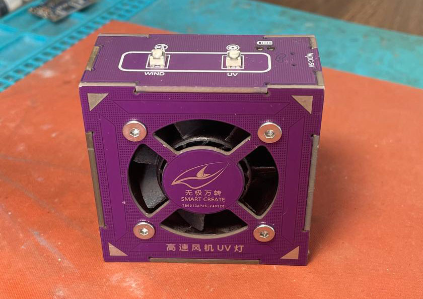
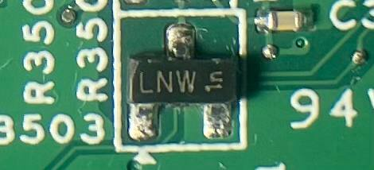
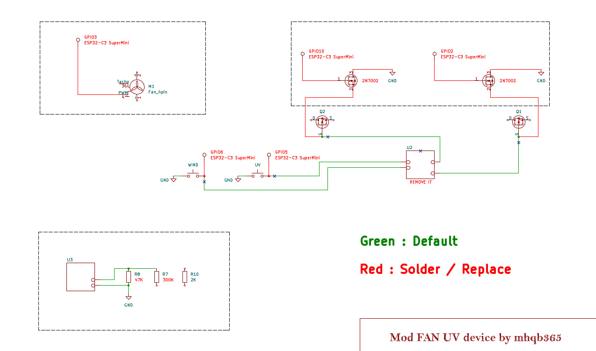
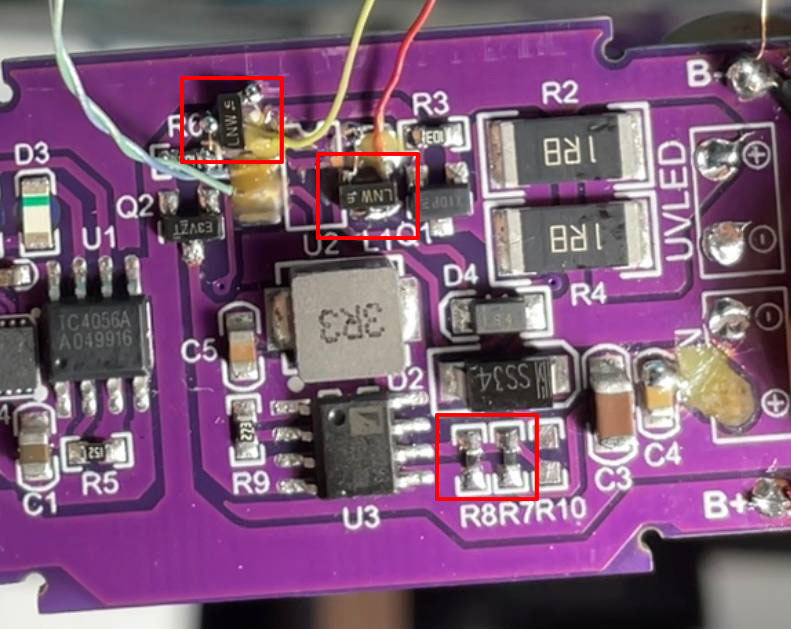

# FAN UV Mod Controller

Dự án mod lại điều khiển cho [Đèn UV đa năng có quạt hút](https://s.shopee.vn/AKTLCMOglM) sử dụng [ESP32-C3 Super Mini](https://s.shopee.vn/4VUL0G2kbb). Do thiết bị ban đầu chỉ có thể bật/tắt quạt, nên trong quá trình hoạt động quạt sẽ kêu to. Dự án này giúp điều khiển quạt với 4 mức tốc độ khác nhau để giảm tiếng ồn, đồng thời vẫn giữ nguyên chức năng đèn UV LED

## Tính năng

- **Điều khiển quạt** với 4 mức tốc độ (35%, 50%, 75%, 100%)
- **Điều khiển đèn UV LED** (bật/tắt)
- **Bảo vệ xung đột**: Quạt và đèn UV không thể hoạt động cùng lúc (tính năng gốc)
- **WiFi AP mode với OTA upload** - Upload code không cần dây USB

## Phần cứng

### Chân kết nối

| Chức năng | GPIO | Loại |
|-----------|------|------|
| Nút điều khiển UV | GPIO 5 | INPUT_PULLUP |
| Nút điều khiển quạt | GPIO 6 | INPUT_PULLUP |
| Kích nguồn đèn UV | GPIO 2 | OUTPUT |
| Kích nguồn quạt | GPIO 10 | OUTPUT |
| PWM quạt | GPIO 3 | OUTPUT (PWM) |

### Linh kiện cần thiết

- [ESP32-C3 Super Mini](https://s.shopee.vn/4VUL0G2kbb)
- [Đèn UV đa năng có quạt hút](https://s.shopee.vn/AKTLCMOglM)

- 2 MOSFET N-channel (2N7002 hoặc tương đương, main laptop nhiều)


## Cách sử dụng

- Hàn MOSFET và kết nối phần cứng theo sơ đồ trong [schematic.pdf](./schematic.pdf)



### Nút điều khiển quạt
- **Single click**: Tăng cấp độ quạt theo chu kỳ
  - OFF → 35% → 50% → 75% → 100% → OFF...
- **Double click**: Tắt quạt ngay lập tức

### Nút điều khiển UV
- **Click ngắn**: Bật/tắt đèn UV LED
- **Giữ 5 giây**: Bật/tắt WiFi AP mode để upload code qua OTA

### WiFi AP Mode & OTA Upload

#### Bật WiFi AP Mode:
1. **Giữ nút UV 5 giây** → LED UV nhấp nháy 6 lần
2. **Kết nối WiFi trên máy tính:**
   - SSID: `FAN-UV-MOD`
   - Password: `12345678`
3. **Upload code qua Arduino IDE:**
   - Mở Arduino IDE
   - Vào **Tools → Port** → Chọn `ESP32-Fan`
   - Click **Upload** như bình thường
4. **Thoát AP mode:** Giữ nút UV 5 giây lần nữa → LED UV nhấp nháy 3 lần

#### Lợi ích OTA:
- ✅ Upload code không cần dây USB
- ✅ Tiện lợi khi ESP32 đã được lắp đặt cố định
- ✅ Password bảo vệ: `12345678`

### Lưu ý
- Khi bật quạt, đèn UV sẽ tự động tắt
- Khi bật đèn UV, quạt sẽ tự động tắt
- Ở chế độ WiFi AP, nút quạt tạm thời không hoạt động
- Tần số PWM: 25kHz (phù hợp với hầu hết các loại quạt DC)

## Cài đặt

### Yêu cầu phần mềm
1. [Arduino IDE](https://www.arduino.cc/en/software) (phiên bản 2.0 trở lên)
2. ESP32 board support
3. Thư viện ArduinoOTA (có sẵn trong ESP32 package)

### Hướng dẫn cài đặt
1. **Cài đặt Arduino IDE**
   
2. **Thêm ESP32 board support:**
   - Vào **File → Preferences**
   - Thêm URL vào "Additional Board Manager URLs":
     ```
     https://raw.githubusercontent.com/espressif/arduino-esp32/gh-pages/package_esp32_index.json
     ```
   - Vào **Tools → Board → Boards Manager**
   - Tìm và cài đặt **esp32** by Espressif Systems
   
3. **Cấu hình board:**
   - **Board**: ESP32C3 Dev Module
   - **USB CDC On Boot**: Enabled (quan trọng!)
   - **CPU Frequency**: 160MHz
   - **Flash Size**: 4MB
   - **Partition Scheme**: Default 4MB with spiffs
   
4. **Upload code lần đầu:**
   - Kết nối ESP32-C3 qua USB
   - Chọn đúng COM port
   - Click Upload
   
5. **Upload lần sau qua OTA:**
   - Giữ nút UV 5 giây để bật WiFi AP
   - Kết nối WiFi `FAN-UV-MOD`
   - Chọn port `ESP32-Fan` và upload

## Thông số kỹ thuật

### PWM
- Tần số PWM: 25kHz
- Độ phân giải PWM: 8-bit (0-255)
- Các mức PWM:
  - OFF: 0 (0%)
  - Level 1: 90 (~35%)
  - Level 2: 128 (50%)
  - Level 3: 191 (75%)
  - Level 4: 255 (100%)

### Timing
- Thời gian chống dội: 50ms
- Thời gian double click: 300ms
- Thời gian long press (WiFi AP): 5000ms (5 giây)

### WiFi AP
- SSID: FAN-UV-MOD
- Password: 12345678
- Default IP: 192.168.4.1
- OTA Hostname: ESP32-Fan
- OTA Password: 12345678

## Xử lý sự cố

### ESP32 mất kết nối USB
- **Nguyên nhân**: Code có lỗi hoặc tắt Serial
- **Giải pháp**: 
  1. Rút USB
  2. Giữ nút BOOT trên ESP32-C3
  3. Cắm lại USB (vẫn giữ BOOT)
  4. Thả BOOT sau 2 giây
  5. Upload code mới

### Không thấy port OTA trong Arduino IDE
- **Kiểm tra**:
  1. Đã giữ nút UV 5 giây? (LED nhấp nháy 6 lần)
  2. Đã kết nối WiFi `FAN-UV-MOD`?
  3. Đợi 10-20 giây sau khi kết nối WiFi
  4. Restart Arduino IDE
- **Serial Monitor**: Kiểm tra IP address và thông báo OTA

### Quạt/UV không hoạt động
- Kiểm tra kết nối phần cứng
- Kiểm tra nguồn điện cho relay/MOSFET
- Xem log trên Serial Monitor (115200 baud)

## Debug

Mở Serial Monitor với baud rate **115200** để xem:
- Trạng thái quạt/UV
- Thông báo nhấn nút
- IP address khi bật WiFi AP
- Tiến trình OTA upload

## Tác giả

> [mhqb365](https://www.google.com/search?q=mhqb365)

## License

MIT License